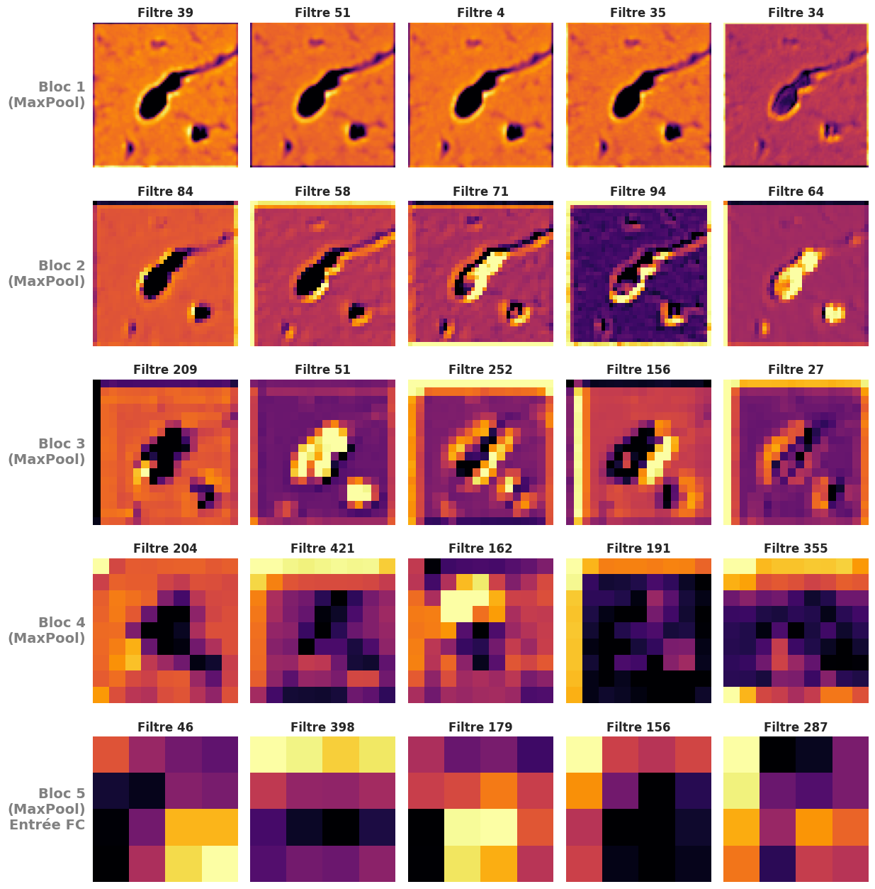

# educ-SMIDS-VGG19

Projet de classification d'images de spermatozoïdes, dans le cadre de l'UE **MLB** de l'université de Rennes. Le jeu de données utilisé est appelé **SMIDS** (Sperm Morphology Image Data Set) et est disponible [ici](https://link.springer.com/article/10.1007/s11517-019-02101-y). Le code est largement inspiré de [cette exploitation](https://www.kaggle.com/code/orvile/sperm-morphology-classification-pytorch) disponible sur Kaggle.

⚙️ python, pytorch, seaborn, matplotlib, pandas, numpy, jupyter notebook, scikit-learn

## Structure du projet
- `data/` : Dossier contenant les résultats des modèles testés.
- `img/` : Dossier contenant les graphiques issus des analyses des résultats.
- `slides_XX-XX.pdf` : Présentation du projet.
- `notebook_XX-XX.ipynb` : Notebook Jupyter contenant le code du projet.

## Méthodologie & résultats

Choix du modèle en deux temps : à partir d'un modèle pré-entrainé VGG19, plusieurs types d'entrée et d'architectures du réseau ont été testés (tableau 1). Le modèle final a été affiné par une recherche d'hyperparamètres (tableau 2).

**Tableau 1 : Comparaison des architectures testées.**
| Modèle | Canaux | Augmentation de données | Dropout | Précision (%) |
| ------ | ------ | ----------------------- | ------- | ------------- |
| A.0    | gris   | Non                     | Non     | 76.22         |
| B.0    | RGB    | Non                     | Non     | 80.22         |
| C.0    | gris   | Oui                     | Non     | 77.11         |
| D.0    | RGB    | Oui                     | Non     | 78.00         |
| E.0    | gris   | Oui                     | Oui     | 76.44         |
| F.0    | RGB    | Oui                     | Oui     | 84.44         |

**Tableau 2 : Résultats de la recherche d'hyperparamètres sur le modèle final (F.0).**
| Modèle | Blocs dégelés | Fonction d'optimisation | Taux d'apprentissage | Précision (%) |
| ------ | ------------- | ----------------------- | -------------------- | ------------- |
| F.0    | non           | Adam                    | 0.0001               | 83.33         |
| F.1    | oui (1)       | Adam                    | 0.0001               | 81.78         |
| F.2    | non           | SGD                     | 0.0001               | 34.89         |
| F.3    | non           | Adam                    | 0.00001              | 84.00         |
| F.4    | non           | Adam                    | 0.001                | 72.89         |

Le modèle final retenu est le **modèle F.0**, avec une précision de 83.33 %.

Pour aller plus loin, des analyses complémentaires ont été réalisées comme une analyse des cartes d'activation. Ces analyses sont disponibles dans le notebook Jupyter `notebook_XX-XX.ipynb` et illustrées par des graphiques dans le dossier `img/`. Exemple : 

**Cartes d'activation des filtres de convolution pour une image classée comme anormale (classe 1) par le modèle F.0**